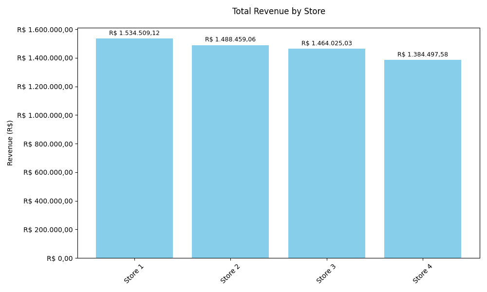
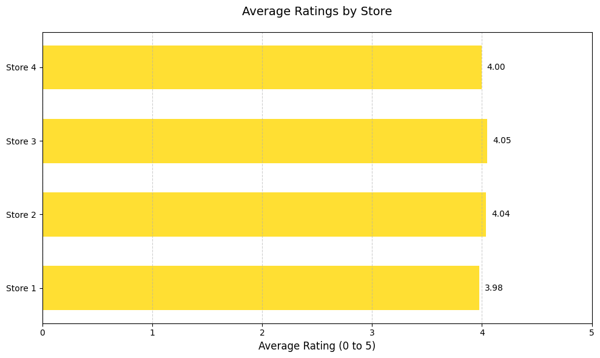
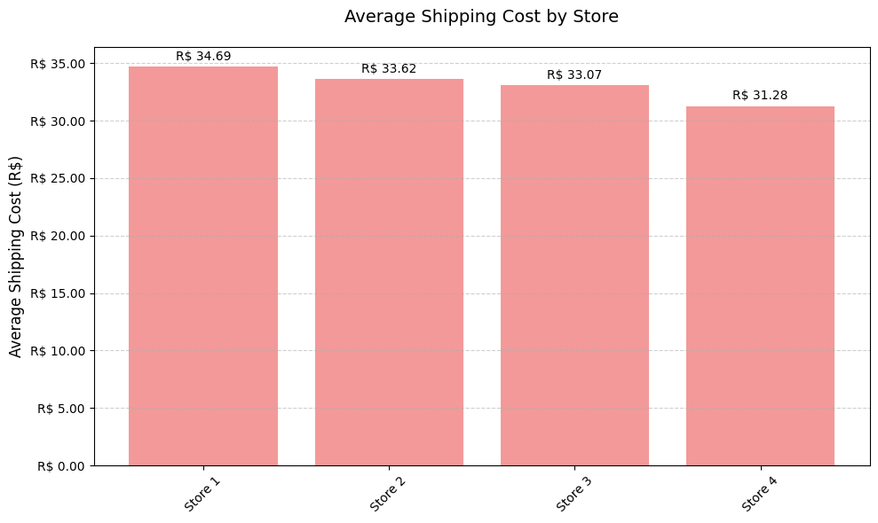
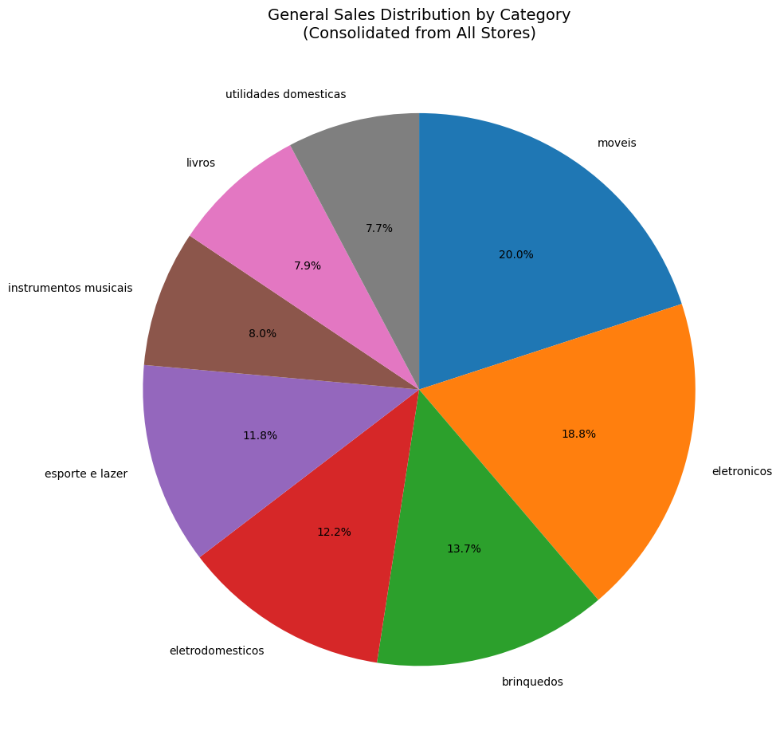
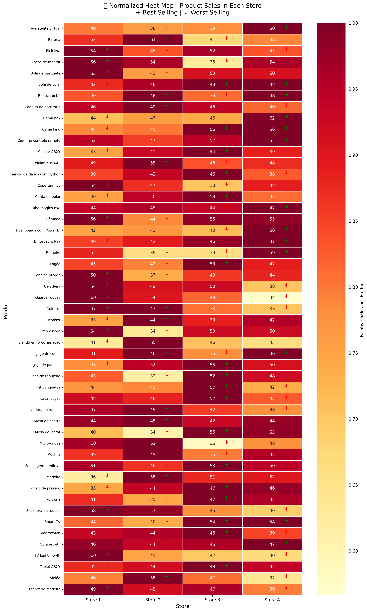
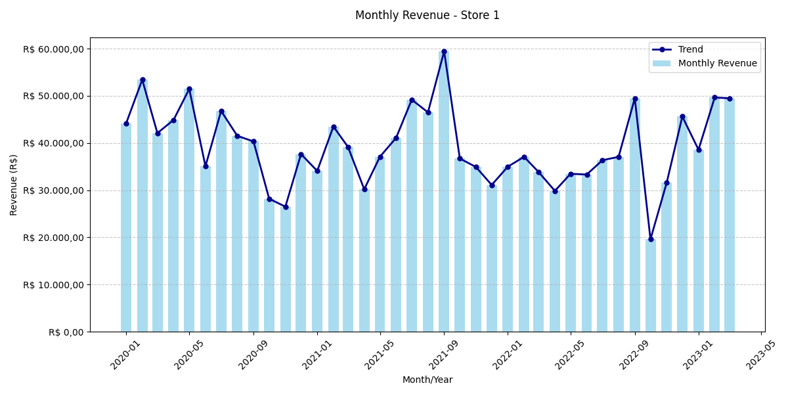
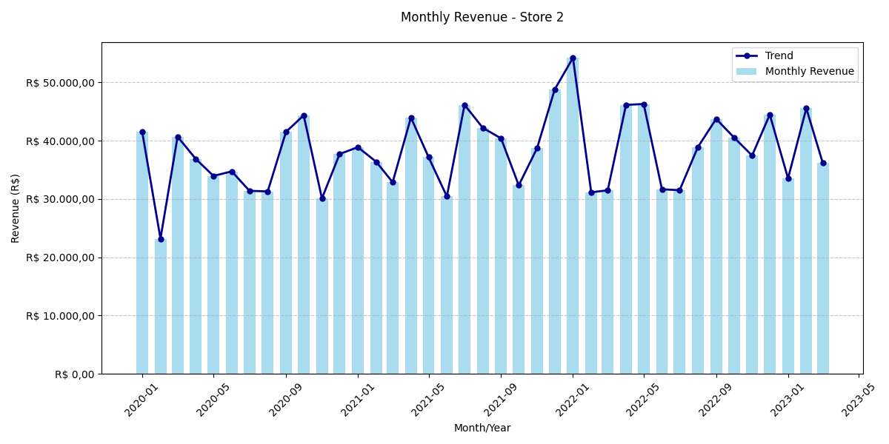
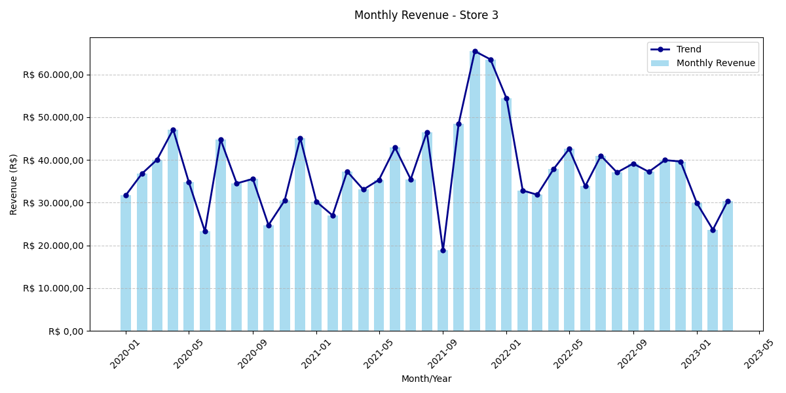
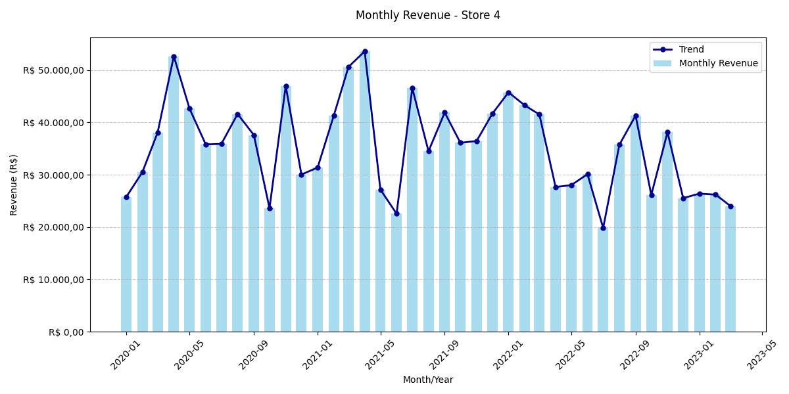

# Oracle Challenge - Alura Store

## 📊 Data Analysis for Strategic Sales Decision

This project presents a comprehensive analysis of sales data from the 4 stores in the Alura Store network, with the objective of identifying which unit should be sold to optimize Mr. João's business portfolio.

---

## 🎯 Project Objective

Analyze revenue data, customer reviews, shipping costs, and sales distribution by category from the 4 stores in the Alura Store network to recommend which store to sell, based on operational efficiency and financial performance criteria.

---

## 📁 Project Structure

```
ORACLE-Challenge_Alura_Store/
├── Outputs/
│   ├── total_revenue_by_store.png
│   ├── average_store_ratings.png
│   ├── average_shipping_cost.png
│   ├── category_sales_comparison_stores.png
│   ├── general_category_sales_distribution.png
│   ├── sales_heat_map.png
│   ├── monthly_revenue_store_1.png
│   ├── monthly_revenue_store_2.png
│   ├── monthly_revenue_store_3.png
│   └── monthly_revenue_store_4.png
├── Stores_Info/
│   ├── loja_1.csv
│   ├── loja_2.csv
│   ├── loja_3.csv
│   └── loja_4.csv
├── Code.ipynb
├── LICENSE
└── README.md
```

---

## 📊 Main Results and Visualizations

### 1. Total Revenue by Store



**Analysis:** Store 1 has the highest revenue (R$ 1,534,509.12), while Store 4 has the lowest (R$ 1,384,497.58), a difference of R$ 150,011.

| Store | Revenue | Position |
|-------|---------|----------|
| Store 1 | R$ 1,534,509.12 | 1st |
| Store 2 | R$ 1,488,459.06 | 2nd |
| Store 3 | R$ 1,464,025.03 | 3rd |
| Store 4 | R$ 1,384,497.58 | 4th |

---

### 2. Average Customer Reviews



**Analysis:** Store 3 has the best rating (4.05), while Store 1, despite having the highest revenue, has the worst rating (3.98).

| Store | Average | Position |
|-------|---------|----------|
| Store 3 | 4.05 | 1st |
| Store 2 | 4.04 | 2nd |
| Store 4 | 4.00 | 3rd |
| Store 1 | 3.98 | 4th |

---

### 3. Average Shipping Cost



**Analysis:** Store 4 has the lowest shipping cost (R$ 31.28), while Store 1 has the highest (R$ 34.69).

| Store | Average Cost | Position |
|-------|--------------|----------|
| Store 4 | R$ 31.28 | 1st (lowest) |
| Store 3 | R$ 33.07 | 2nd |
| Store 2 | R$ 33.62 | 3rd |
| Store 1 | R$ 34.69 | 4th (highest) |

---

### 4. General Sales Distribution by Category



**Analysis:** Furniture (20.0%) and Electronics (18.8%) are the dominant categories across all stores.

---

### 5. Sales Comparison by Category Between Stores


**Analysis:** Store 3 stands out with the highest participation in furniture (21.2%), a category with higher added value.

---

### 6. Heat Map - Sales by Product



**Analysis:** Normalized visualization shows specific sales patterns by product in each store, identifying best and worst-selling products with visual indicators (+ for best, ↓ for worst).

---

## 🎯 Final Recommendation

### **SELL STORE 4**


#### Justifications:

✅ **Lowest revenue** in the network (R$ 1,384,497.58)  
✅ **Minimal impact** on total revenue (23.6% of total revenue)  
✅ **Preservation** of best-performing stores  
✅ **Business portfolio optimization**  

#### Decision Benefits:
- Resource concentration on the 3 most efficient stores
- Maintenance of 76.4% of the network's total revenue
- Preservation of stores with better customer satisfaction
- Capital release for the new venture

---

## 📈 Temporal Analysis - Monthly Revenue

### Store 1


### Store 2


### Store 3


### Store 4


---

## 🚀 How to Run the Project

### Prerequisites
```bash
pip install pandas matplotlib seaborn jupyter
```

### Installation
1. Clone the repository:
```bash
git clone https://github.com/jprozette/ORACLE-Challenge_Alura_Store.git
cd ORACLE-Challenge_Alura_Store
```

2. Run Jupyter Notebook:
```bash
jupyter notebook
```

3. Open the `Code.ipynb` file and execute the cells sequentially.

### Data Structure
Each CSV file in the `StoresA_Info/` folder contains:
- Sales data by product
- Customer reviews
- Shipping information
- Product categories
- Transaction dates

---

## 📊 Analyzed Metrics

### Main Data
- **Total Revenue by Store**
- **Average Customer Reviews** (0-5 scale)
- **Average Shipping Cost**
- **Sales Distribution by Category**
- **Temporal Revenue Analysis**
- **Product Sales Heat Map**
- **Efficiency Score** (Revenue/Shipping Cost ratio)

### Product Categories
- Furniture (20.0%)
- Electronics (18.8%)
- Toys (13.7%)
- Home Appliances (12.2%)
- Sports & Leisure (11.8%)
- Musical Instruments (8.0%)
- Books (7.9%)
- Household Items (7.7%)

---

## 📋 Generated Files

The analysis generates the following visualization files:
- `total_revenue_by_store.png` - Consolidated revenue comparison
- `monthly_revenue_store_[1-4].png` - Individual monthly trends
- `average_store_ratings.png` - Customer satisfaction comparison
- `average_shipping_cost.png` - Logistics efficiency analysis
- `category_sales_comparison_stores.png` - Category performance by store
- `general_category_sales_distribution.png` - Overall market overview
- `sales_heat_map.png` - Product performance matrix

---

## 🔍 Key Insights

### Performance Summary
- **Best Revenue**: Store 1 (R$ 1,534,509.12)
- **Best Customer Rating**: Store 3 (4.05/5.0)
- **Best Shipping Efficiency**: Store 4 (R$ 31.28)
- **Most Balanced Performance**: Store 2

### Strategic Analysis
The analysis reveals that while Store 1 generates the highest revenue, it has the lowest customer satisfaction and highest shipping costs. Store 3 demonstrates the best balance between customer satisfaction and operational efficiency. Store 4, despite having the best shipping costs, shows the lowest overall revenue generation.

---

## 🤝 Contributions

This project was developed as part of Alura's Oracle Challenge. Contributions are welcome through:

1. Fork the project
2. Create a branch for your feature
3. Commit your changes
4. Push to the branch
5. Open a Pull Request

---

## 📝 License

This project is under the MIT license. See the `LICENSE` file for more details.

---

## 👨‍💻 Author

**João Paulo Rozette**
- GitHub: [@jprozette](https://github.com/jprozette)
- Project: Oracle Challenge Alura Store

---

## 📞 Contact

For questions or suggestions about this project, contact through GitHub or open an issue in the repository.

---

