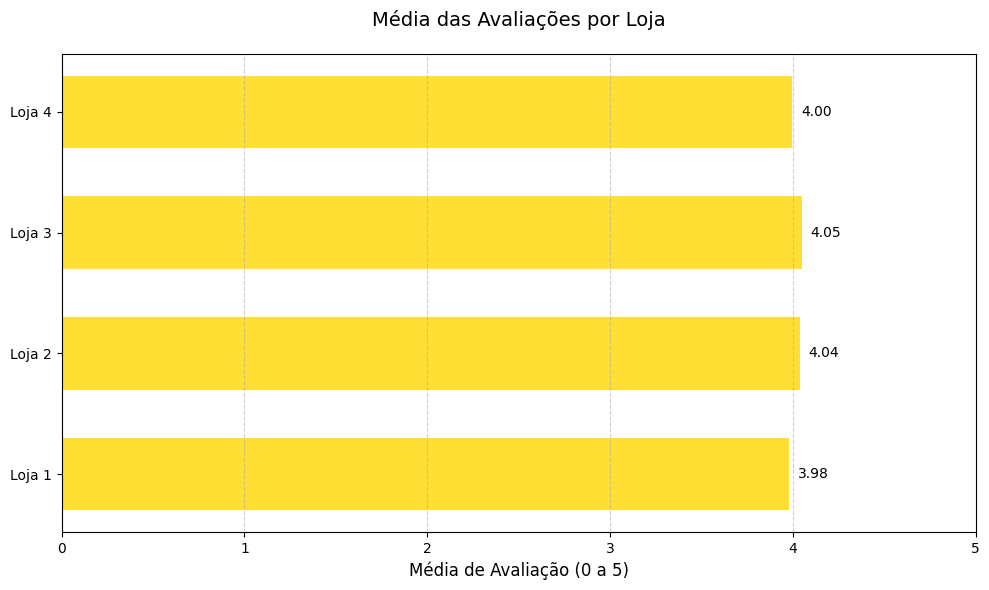
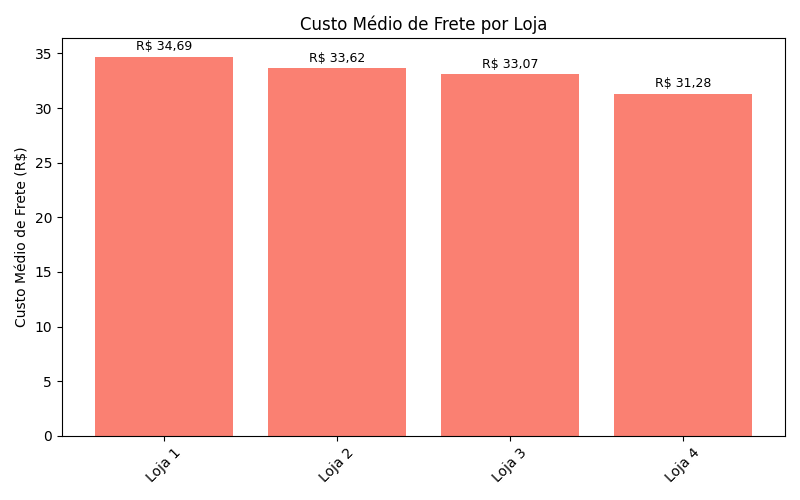
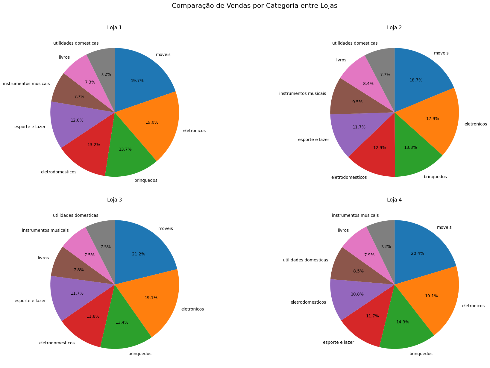
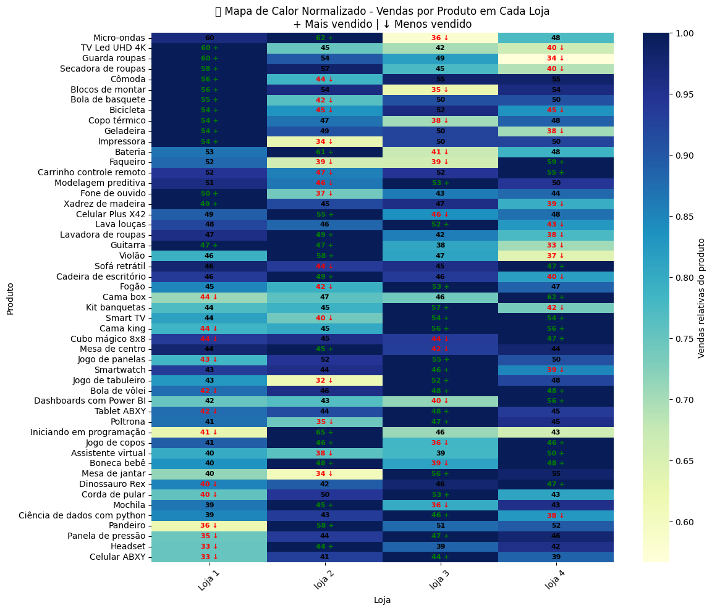
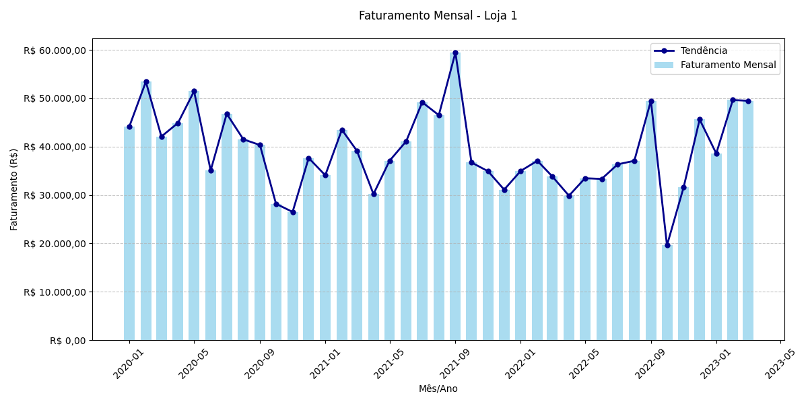
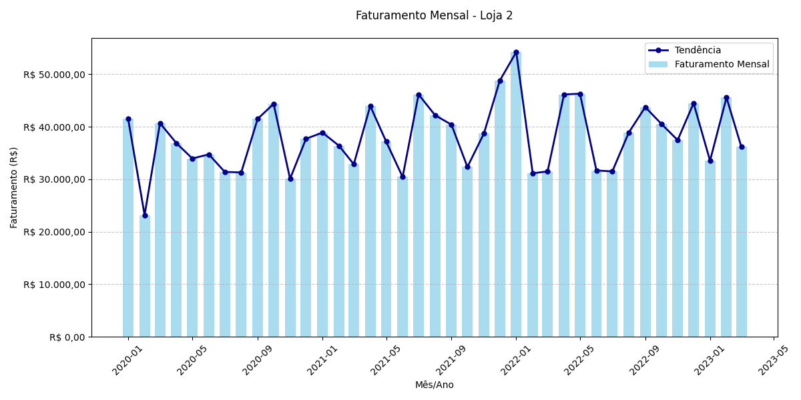
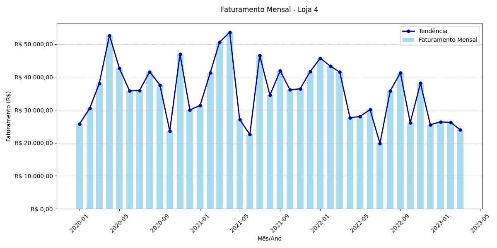

# Oracle Challenge - Alura Store

## 📊 Análise de Dados para Decisão Estratégica de Vendas

Este projeto apresenta uma análise completa dos dados de vendas das 4 lojas da rede Alura Store, com o objetivo de identificar qual unidade deve ser vendida para otimizar o portfólio de negócios do Senhor João.

---

## 🎯 Objetivo do Projeto

Analisar dados de faturamento, avaliações de clientes, custos de frete e distribuição de vendas por categoria das 4 lojas da rede Alura Store para recomendar qual loja vender, baseando-se em critérios de eficiência operacional e desempenho financeiro.

---

## 📁 Estrutura do Projeto

```
ORACLE-Challenge_Alura_Store/
├── Info_Lojas/
│   ├── loja_1.csv
│   ├── loja_2.csv
│   ├── loja_3.csv
│   └── loja_4.csv
├── Outputs/
│   ├── faturamento_total_por_loja.png
│   ├── media_avaliacoes_lojas.png
│   ├── custo_medio_frete.png
│   ├── comparacao_vendas_categorias_lojas.png
│   ├── distribuicao_geral_vendas_categoria.png
│   ├── mapa_calor_vendas.png
│   ├── faturamento_mensal_loja_1.png
│   ├── faturamento_mensal_loja_2.png
│   ├── faturamento_mensal_loja_3.png
│   └── faturamento_mensal_loja_4.png
├── Code.ipynb
├── LICENSE
└── README.md
```

---

## 📊 Principais Resultados e Visualizações

### 1. Faturamento Total por Loja


**Análise:** A Loja 1 apresenta o maior faturamento (R$ 1.534.509,12), enquanto a Loja 4 tem o menor (R$ 1.384.497,58), uma diferença de R$ 150.011.

| Loja | Faturamento | Posição |
|------|-------------|---------|
| Loja 1 | R$ 1.534.509,12 | 1º |
| Loja 2 | R$ 1.488.459,06 | 2º |
| Loja 3 | R$ 1.464.025,03 | 3º |
| Loja 4 | R$ 1.384.497,58 | 4º |

---

### 2. Média de Avaliações dos Clientes



**Análise:** A Loja 3 possui a melhor avaliação (4,05), enquanto a Loja 1, apesar do maior faturamento, tem a pior avaliação (3,98).

| Loja | Média | Posição |
|------|-------|---------|
| Loja 3 | 4,05 | 1º |
| Loja 2 | 4,04 | 2º |
| Loja 4 | 4,00 | 3º |
| Loja 1 | 3,98 | 4º |

---

### 3. Custo Médio de Frete



**Análise:** A Loja 4 tem o menor custo de frete (R$ 31,28), enquanto a Loja 1 tem o maior (R$ 34,69).

| Loja | Custo Médio | Posição |
|------|-------------|---------|
| Loja 4 | R$ 31,28 | 1º (menor) |
| Loja 3 | R$ 33,07 | 2º |
| Loja 2 | R$ 33,62 | 3º |
| Loja 1 | R$ 34,69 | 4º (maior) |

---

### 4. Distribuição Geral de Vendas por Categoria


**Análise:** Móveis (20,0%) e Eletrônicos (18,8%) são as categorias dominantes em todas as lojas.

---

### 5. Comparação de Vendas por Categoria entre Lojas



**Análise:** A Loja 3 se destaca com maior participação em móveis (21,2%), categoria de maior valor agregado.

---

### 6. Mapa de Calor - Vendas por Produto



**Análise:** Visualização normalizada mostra padrões de vendas específicos por produto em cada loja, identificando produtos mais e menos vendidos.

---

## 🎯 Recomendação Final

### **VENDER A LOJA 4**


#### Justificativas:

✅ **Menor faturamento** da rede (R$ 1.384.497,58)  
✅ **Menor impacto** na receita total (23,6% do faturamento)  
✅ **Preservação** das lojas com melhor desempenho  
✅ **Otimização** do portfólio de negócios  

#### Benefícios da Decisão:
- Concentração de recursos nas 3 lojas mais eficientes
- Manutenção de 76,4% do faturamento total da rede
- Preservação das lojas com melhor satisfação do cliente
- Liberação de capital para o novo empreendimento

---

## 📈 Análise Temporal - Faturamento Mensal

### Loja 1


### Loja 2


### Loja 3


### Loja 4


---

## 🚀 Como Executar o Projeto

### Pré-requisitos
```bash
pip install pandas matplotlib jupyter
```

### Instalação
1. Clone o repositório:
```bash
git clone https://github.com/jprozette/ORACLE-Challenge_Alura_Store.git
cd ORACLE-Challenge_Alura_Store
```

2. Execute o Jupyter Notebook:
```bash
jupyter notebook
```

3. Abra o arquivo principal de análise e execute as células sequencialmente.

---

## 📊 Métricas Analisadas

### Dados Principais
- **Faturamento Total por Loja**
- **Média de Avaliações dos Clientes** (escala 0-5)
- **Custo Médio de Frete**
- **Distribuição de Vendas por Categoria**
- **Análise Temporal de Faturamento**
- **Mapa de Calor de Vendas por Produto**

### Categorias de Produtos
- Móveis (20,0%)
- Eletrônicos (18,8%)
- Brinquedos (13,7%)
- Eletrodomésticos (12,2%)
- Esporte e Lazer (11,8%)
- Instrumentos Musicais (8,0%)
- Livros (7,9%)
- Utilidades Domésticas (7,7%)

---

## 🤝 Contribuições

Este projeto foi desenvolvido como parte do Oracle Challenge da Alura. Contribuições são bem-vindas através de:

1. Fork do projeto
2. Criação de uma branch para sua feature
3. Commit das mudanças
4. Push para a branch
5. Abertura de um Pull Request

---

## 📝 Licença

Este projeto está sob a licença MIT. Veja o arquivo `LICENSE` para mais detalhes.

---

## 👨‍💻 Autor

**João Paulo Rozette**
- GitHub: [@jprozette](https://github.com/jprozette)
- Projeto: Oracle Challenge Alura Store

---

## 📞 Contato

Para dúvidas ou sugestões sobre este projeto, entre em contato através do GitHub ou abra uma issue no repositório.

---
